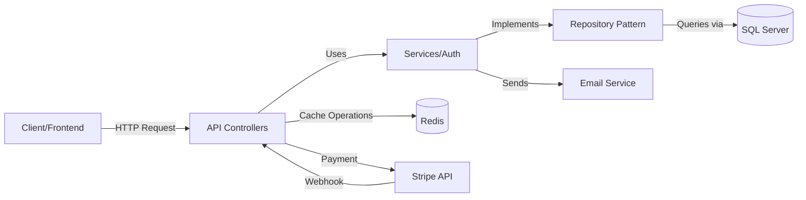

<div align="center">

# 🛒 Enterprise E-Commerce Platform API

### Production-Ready RESTful API Built with ASP.NET Core 9.0

[](https://dotnet.microsoft.com/)
[](https://docs.microsoft.com/en-us/dotnet/csharp/)
[](LICENSE)

**A comprehensive, scalable e-commerce backend demonstrating enterprise-level software engineering practices, clean architecture, and modern API design patterns.**

[Features](#-key-features) • [Architecture](#-architecture--design-patterns) • [Tech Stack](#-technology-stack) • [Setup](#%EF%B8%8F-quick-start) • [API Documentation](#-api-documentation)

</div>

---

## 🌟 Project Highlights

> **What Makes This Project Stand Out:**
> - ✅ **Clean Architecture** with clear separation of concerns across 3+ layers
> - ✅ **Enterprise Design Patterns**: Repository, Unit of Work, Specification, CQRS concepts
> - ✅ **Production-Ready Security**: JWT authentication, role-based authorization, password reset flows, email verification
> - ✅ **Payment Integration**: Full Stripe payment processing with webhooks
> - ✅ **High Performance**: Redis caching, query optimization, async/await throughout
> - ✅ **Comprehensive API**: 30+ endpoints covering complete e-commerce functionality
> - ✅ **Professional Testing**: Unit tests with NUnit, mocking with Moq
> - ✅ **API Documentation**: Fully documented with Swagger/OpenAPI
> - ✅ **Database Optimization**: Entity Framework Core with migrations, seeding, and relationship management

---

## 🚀 Key Features

### 🔐 Authentication & Account Management
- **JWT-based authentication** with refresh token support
- **Role-based authorization** (Admin, User, Moderator)
- **Complete password management**:
  - Forgot password with email tokens
  - Reset password with secure token validation
  - Change password for authenticated users
- **Email verification** with confirmation tokens
- **Resend confirmation emails**
- Email enumeration protection for security

### 🛍️ Product Management
- Full CRUD operations with role-based access control
- **Advanced filtering & sorting** using Specification Pattern
- **Pagination** for optimal performance
- Product photos management with multiple images
- Category-based organization
- Product search and filtering by brand/category/price

### 🛒 Shopping Basket
- **Redis-backed cart** for ultra-fast performance
- Real-time basket updates (add, update, remove items)
- Persistent baskets across sessions
- Automatic basket creation for new users
- Stock validation before checkout

### 📦 Order Management
- Complete order lifecycle management
- Order history with detailed tracking
- **Order status tracking**: Pending → Processing → Shipped → Delivered
- Shipping address management
- Order items with pricing snapshots

### 💳 Payment Processing
- **Stripe integration** with PaymentIntent API
- Secure payment processing with PCI compliance
- **Webhook handling** for payment confirmations
- Payment status synchronization with orders
- Support for multiple payment methods

### 🐛 Bug Reporting & Error Tracking
- Built-in bug reporting system
- Global exception handling middleware
- Structured error responses
- Logging and monitoring ready

---

## 🏗️ Architecture & Design Patterns

This project demonstrates **professional software engineering practices** and **enterprise-level architecture**:


### Design Patterns Implemented

| Pattern | Purpose | Implementation |
|---------|---------|----------------|
| **Repository Pattern** | Data access abstraction | Generic repositories for all entities |
| **Unit of Work** | Transaction management | Coordinated repository operations |
| **Specification Pattern** | Complex query encapsulation | Reusable, testable query logic |
| **Dependency Injection** | Loose coupling | Built-in ASP.NET Core DI container |
| **DTO Pattern** | Data transfer optimization | Separate DTOs for requests/responses |
| **Factory Pattern** | Object creation | Token generation, email templates |
| **Middleware Pattern** | Cross-cutting concerns | Global exception handling, logging |

---

## 🛠️ Technology Stack

### Backend Framework
- **ASP.NET Core 9.0** - Latest .NET framework for high-performance APIs
- **C# 12.0** - Modern language features (records, pattern matching, etc.)
- **Entity Framework Core 9.0** - ORM with code-first migrations

### Databases & Caching
- **Microsoft SQL Server** - Primary relational database
- **Redis** - High-performance in-memory cache for baskets

### Security & Authentication
- **ASP.NET Core Identity** - User management and authentication
- **JWT (JSON Web Tokens)** - Stateless authentication
- **BCrypt** - Secure password hashing

### Payment & External Services
- **Stripe API** - Payment processing integration
- **MailKit** - Email service for notifications

### Tools & Libraries
- **AutoMapper** - Object-to-object mapping
- **Swagger/OpenAPI** - Interactive API documentation
- **NUnit** - Unit testing framework
- **Moq** - Mocking framework for tests
- **FluentValidation** - Request validation

### DevOps & Best Practices
- **Git** - Version control
- **Async/Await** - Asynchronous programming throughout
- **Dependency Injection** - Inversion of Control
- **SOLID Principles** - Clean, maintainable code

---

## 📂 Project Structure

```
WebApiEcomm.sln
│
├── 📱 WebApiEcomm.API/              # Presentation Layer
│   ├── Controllers/                  # RESTful API endpoints (30+ endpoints)
│   │   ├── AccountController.cs     # Auth, password reset, email confirmation
│   │   ├── ProductsController.cs    # Product CRUD with filtering
│   │   ├── BasketController.cs      # Shopping cart operations
│   │   ├── OrdersController.cs      # Order management
│   │   ├── PaymentController.cs     # Stripe payment integration
│   │   ├── CategoriesController.cs  # Category management
│   │   └── BugController.cs         # Bug reporting
│   ├── Extensions/                   # Service registration extensions
│   ├── Middleware/                   # Global error handling
│   ├── Helper/                       # Pagination, response wrappers
│   └── Program.cs                    # Application startup & configuration
│
├── 💼 WebApiEcomm.Core/             # Domain Layer (Business Logic)
│   ├── Entites/                      # Domain models
│   │   ├── Product.cs               # Product entity with relationships
│   │   ├── Order.cs, OrderItem.cs   # Order aggregates
│   │   ├── Basket.cs, BasketItem.cs # Shopping cart models
│   │   ├── Category.cs, Photo.cs    # Supporting entities
│   │   └── Identity/                # User identity models
│   ├── Entites/Dtos/                # Data Transfer Objects
│   │   ├── LoginDto, RegisterDto    # Authentication DTOs
│   │   ├── ResetPasswordDto         # Password management
│   │   ├── ProductDto, OrderDto     # Entity DTOs
│   │   └── PaginationDto            # Pagination models
│   ├── Interfaces/                   # Abstractions & contracts
│   │   ├── IGenericRepository.cs    # Generic repository interface
│   │   ├── IUnitOfWork.cs           # Unit of Work pattern
│   │   ├── Auth/IAuth.cs            # Authentication service
│   │   └── Payment/IPaymentService.cs
│   ├── Services/                     # Service interfaces
│   └── Specifications/               # Query specifications
│       ├── ProductSpecification.cs  # Product filtering logic
│       └── OrderSpecification.cs    # Order queries
│
├── 🗄️ WebApiEcomm.InfraStructure/   # Data Access Layer
│   ├── Data/                         # EF Core context & migrations
│   │   ├── AppDbContext.cs          # Main database context
│   │   ├── StoreDbContextSeed.cs    # Data seeding
│   │   └── Migrations/              # Database migrations
│   ├── Identity/                     # Identity configuration
│   │   └── AppIdentityDbContext.cs  # Identity DB context
│   ├── Repositores/                  # Repository implementations
│   │   ├── GenericRepository.cs     # Generic repository
│   │   ├── AuthRepository.cs        # Authentication logic
│   │   ├── ProductRepository.cs     # Product-specific queries
│   │   └── Service/                 # Service implementations
│   │       ├── EmailService.cs      # Email sending service
│   │       ├── PaymentService.cs    # Stripe integration
│   │       └── TokenService.cs      # JWT token generation
│   └── UnitOfWork.cs                # Unit of Work implementation
│
└──
```

---

## ⚙️ Quick Start

### Prerequisites
- [.NET 9.0 SDK](https://dotnet.microsoft.com/download)
- [SQL Server](https://www.microsoft.com/en-us/sql-server/sql-server-downloads) (or SQL Server Express)
- [Redis](https://redis.io/download) (optional, for basket caching)
- [Stripe Account](https://stripe.com) (for payment testing)

### 1️⃣ Clone the Repository
```bash
git clone https://github.com/muhamedhamedvl/Ecomm-App-Dot-Net-With-Angular.git
cd WebApiEcomm
```

### 2️⃣ Configure Settings
Update `appsettings.json` with your configuration:

```json
{
  "ConnectionStrings": {
    "DefaultConnection": "Server=;Database=;Trusted_Connection=True;TrustServerCertificate=True;",
    "IdentityConnection": "Server=;Database=;Trusted_Connection=True;TrustServerCertificate=True;",
    "Redis": "localhost:6379"
  },
  "Token": {
    "Key": "",
    "Issuer": "https://localhost:5171"
  },
  "StripeSettings": {
    "PublishableKey": "pk_test_...",
    "SecretKey": "sk_test_...",
    "WhSecret": "whsec_..."
  },
  "EmailSetting": {
    "Smtp": "",
    "Port": "587",
    "From": "",
    "UserName": "",
    "Password": ""
  }
}
```

### 3️⃣ Apply Database Migrations
```bash
dotnet ef database update --project WebApiEcomm.InfraStructure --startup-project WebApiEcomm.API --context AppDbContext
dotnet ef database update --project WebApiEcomm.InfraStructure --startup-project WebApiEcomm.API --context AppIdentityDbContext
```

### 4️⃣ Run the Application
```bash
dotnet run --project WebApiEcomm.API
```

The API will be available at: **https://localhost:5171**

### 5️⃣ Explore API Documentation
Open Swagger UI: **https://localhost:5171/swagger**

---

## 📚 API Documentation

### 🔐 Account Endpoints

| Endpoint | Method | Description | Auth Required |
|----------|--------|-------------|---------------|
| `/api/v1/Account/register` | POST | Register new user | ❌ |
| `/api/v1/Account/login` | POST | Login and get JWT token | ❌ |
| `/api/v1/Account/current-user` | GET | Get current user info | ✅ |
| `/api/v1/Account/check-email` | GET | Check if email exists | ❌ |
| `/api/v1/Account/forgot-password` | POST | Request password reset | ❌ |
| `/api/v1/Account/reset-password` | POST | Reset password with token | ❌ |
| `/api/v1/Account/change-password` | POST | Change password | ✅ |
| `/api/v1/Account/confirm-email` | POST | Confirm email address | ❌ |
| `/api/v1/Account/resend-confirmation-email` | GET | Resend confirmation email | ✅ |

### 🛍️ Products Endpoints

| Endpoint | Method | Description | Auth Required |
|----------|--------|-------------|---------------|
| `/api/v1/Products` | GET | Get paginated products with filters | ❌ |
| `/api/v1/Products/{id}` | GET | Get product by ID | ❌ |
| `/api/v1/Products` | POST | Create new product | ✅ Admin |
| `/api/v1/Products/{id}` | PUT | Update product | ✅ Admin |
| `/api/v1/Products/{id}` | DELETE | Delete product | ✅ Admin |

**Filtering Support:**
- `?search=laptop` - Search by name
- `?categoryId=1` - Filter by category
- `?brandId=2` - Filter by brand
- `?sort=priceAsc` - Sort options: `priceAsc`, `priceDesc`, `nameAsc`, `nameDesc`
- `?pageIndex=1&pageSize=10` - Pagination

### 🛒 Basket Endpoints

| Endpoint | Method | Description | Auth Required |
|----------|--------|-------------|---------------|
| `/api/v1/Basket` | GET | Get basket | ❌ |
| `/api/v1/Basket` | POST | Create/Update basket | ❌ |
| `/api/v1/Basket` | DELETE | Delete basket | ❌ |

### 📦 Orders Endpoints

| Endpoint | Method | Description | Auth Required |
|----------|--------|-------------|---------------|
| `/api/v1/Orders` | GET | Get user orders | ✅ |
| `/api/v1/Orders/{id}` | GET | Get order by ID | ✅ |
| `/api/v1/Orders` | POST | Create order from basket | ✅ |

### 💳 Payment Endpoints

| Endpoint | Method | Description | Auth Required |
|----------|--------|-------------|---------------|
| `/api/v1/Payment/{basketId}` | POST | Create Stripe PaymentIntent | ✅ |
| `/api/v1/Payment/webhook` | POST | Stripe webhook handler | ❌ |

### 📁 Categories Endpoints

| Endpoint | Method | Description | Auth Required |
|----------|--------|-------------|---------------|
| `/api/v1/Categories` | GET | Get all categories | ❌ |
| `/api/v1/Categories/{id}` | GET | Get category by ID | ❌ |
| `/api/v1/Categories` | POST | Create category | ✅ Admin |
| `/api/v1/Categories/{id}` | PUT | Update category | ✅ Admin |
| `/api/v1/Categories/{id}` | DELETE | Delete category | ✅ Admin |

### 🐛 Bug Endpoints

| Endpoint | Method | Description | Auth Required |
|----------|--------|-------------|---------------|
| `/api/v1/Bug/not-found` | GET | Test 404 error | ❌ |
| `/api/v1/Bug/server-error` | GET | Test 500 error | ❌ |
| `/api/v1/Bug/bad-request` | GET | Test 400 error | ❌ |

---

## 🧪 Testing

### Run Unit Tests
```bash
dotnet test
```

### Test Coverage
- ✅ Controller tests with mocked services
- ✅ Repository tests with in-memory database
- ✅ Service layer tests
- ✅ DTO validation tests

---

## 🔄 System Architecture Flow



---

## 💡 Key Technical Achievements

### 1. **Scalable Architecture**
- Clean separation between presentation, domain, and data layers
- Dependency injection throughout for loose coupling
- Interface-based programming for testability

### 2. **Performance Optimization**
- **Redis caching** for shopping baskets (sub-millisecond access)
- **Async/await** for non-blocking I/O operations
- **Pagination** to handle large datasets efficiently
- **Query optimization** using Specification Pattern

### 3. **Security Best Practices**
- **JWT authentication** with secure token generation
- **Role-based authorization** for admin operations
- **Password hashing** with ASP.NET Identity
- **Email enumeration protection** in forgot password flow
- **Secure payment processing** via Stripe PCI-compliant API

### 4. **Production-Ready Code**
- Global exception handling middleware
- Consistent API response format
- Comprehensive input validation
- Detailed Swagger documentation
- Unit test coverage
- Structured logging ready

### 5. **Advanced Features**
- **Webhook handling** for async payment confirmation
- **Email verification** system with tokens
- **Password reset** flow with secure token expiration
- **Specification Pattern** for complex queries
- **Unit of Work** for transaction management

---

## 🎯 Skills Demonstrated

This project showcases proficiency in:

- ✅ **Backend Development**: ASP.NET Core, Web API, RESTful design
- ✅ **Database Design**: EF Core, SQL Server, migrations, relationships
- ✅ **Caching**: Redis integration and optimization
- ✅ **Authentication & Security**: JWT, Identity, OAuth concepts
- ✅ **Payment Integration**: Stripe API, webhooks
- ✅ **Design Patterns**: Repository, Unit of Work, Specification, Factory, DI
- ✅ **Clean Architecture**: Layered design, SOLID principles
- ✅ **Testing**: Unit testing, mocking, TDD concepts
- ✅ **API Documentation**: Swagger/OpenAPI
- ✅ **Version Control**: Git workflows
- ✅ **Problem Solving**: Complex business logic implementation

---

## 📈 Future Enhancements

- [ ] Implement GraphQL API for flexible querying
- [ ] Add SignalR for real-time order status updates
- [ ] Implement rate limiting and API throttling
- [ ] Add distributed caching with Redis Cluster
- [ ] Implement CQRS pattern with MediatR
- [ ] Add comprehensive integration tests
- [ ] Implement Docker containerization
- [ ] Add health checks and monitoring endpoints
- [ ] Implement API versioning
- [ ] Add advanced logging with Serilog

---

## 📞 Contact & Connect

<div align="center">

### **Mohamed Hamed**
**Senior Backend Developer | ASP.NET Core Specialist**

[](mailto:mh1191128@gmail.com)
[](www.linkedin.com/in/muhamed-hamed-3a2a25250)
[](https://github.com/muhamedhamedvl)

</div>

---

## 📄 License

This project is licensed under the MIT License - see the [LICENSE](LICENSE) file for details.

---

<div align="center">

### ⭐ If you find this project impressive, please give it a star!

**Built with ❤️ using ASP.NET Core 9.0**

</div>
